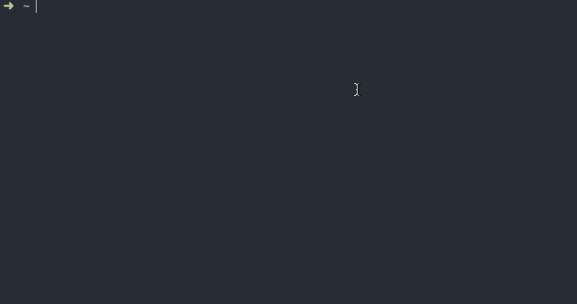

# Command Lionel

🗞 The latest news from the Financial Times in your terminal.

<div align="center">


</div>


## Features

* View the latest curated content from the top sections of FT.com
* Re-formats XML content into plain text for the terminal
* Supports the display of lists, headings, and quotes
* Works with a single key for the [FT API]

[FT API]: https://developer.ft.com


## Installation

This is a [Node.js] module available through the [npm] registry. Node.js 8 or newer is required. If you are unsure what Node.js version is installed you can check using this command:

```sh
node --version
```

If Node.js is not installed or you do not have a supported versioned installed you should follow [these instructions], otherwise you can continue with the installation:

```sh
npm install -g lionel
```

Once complete you can verify the installation by running the Lionel command:

```sh
lionel
```

The command will exit with the following error:

```sh
> Oh no, something went wrong: Error: No API key found
```

This is expected because Lionel requires a key for the FT API in order to access content. To acquire a key you should use the `/get-developer-apikey` [Slack] command and select the "C-API v2 - Internal Apps" policy.

Once you have a key for the FT API you can provide it to the Lionel command in one of two ways:

1.
    Set the key as an environment variable named `API_KEY`:

    ```sh
    export API_KEY='your API key'
    ```

2.
    Create a dotfile containing the key in your home directory named `.ft-api-key`:

    ```sh
    echo 'your API key' > ~/.ft-api-key
    ```

After configuring a key run the Lionel command again which should now render a list of sections to choose from:

```sh
lionel
```

If you receive a 403 error please check your key permissions with the Universal Publishing team.

[Node.js]: https://nodejs.org/en/
[npm]: https://www.npmjs.com/
[these instructions]: https://nodejs.org/en/download/
[Slack]: https://financialtimes.slack.com/
